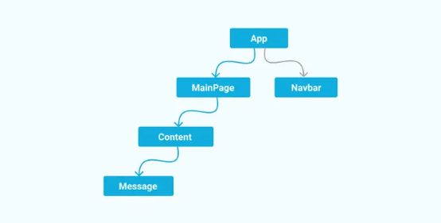

# React Context is Just a Global Variable

I’ve been working on the AILOGO editor page for a while now and have frequently used both the `useContext` and `useReducer` hooks. In this article, we’ll focus on `useContext`, and save `useReducer` for the next one. It’s been exciting to dive deep into business logic and sharpen React programming skills. Along the way, We'll gained a better understanding of React’s core mechanisms and philosophy. So, let’s jump right in!




## Props Hell Problem
**The purpose of using context is to avoid "props hell".** Due to certain code-splitting reasons, we use so many components and they're nested. If child components need a state from ancestor components, that state must be passed down by props attribute all the way down. And we even have to pass callback functions as well because they'll update the state. Image we'll do this to so many states and components. Using props to pass down through nested components is annoying and called Props Hell or Props Drilling. Nobody loves it.🤭

To figure this out, we just need a global varibale to make sure we can read data wherever we want instead of passing the data.

- What is the global variable web developers are familiar the most???🤗
- `window` (shout out load!!!!😻

But in React world, we also have another global variable `context`. Why is it called context? Context means the history, means the environment, means the communication back and forth, means we can get some information from that!

I'll show you the secenaros that your child component needs to read data, and you get data from global window or context object
```javascript
// Image the data is a object, {name: 'Jinzhe Yang'}. So we bind this data to window object

// we can assign this in any modules, but be careful to the module loading orders otherwise you'll get a undefined
window.value = {name: 'zingeryang'}

// The component needing this data
const Hello = () => {
	const { name } = window.value;

	return <p>Hello {name}</p>
}
```
```javascript
// Image the data is a object, {name: 'Jinzhe Yang'}. Use createContext to create a context object

// can be assigned in other modules, we'll just assign within Hello component module here for convenience
const valueContext = createContext({name: 'zingeryang'}) 

// The component needing our data
const Hello = () => {
	// useContext helps us fetch context and use it
	const { name } = useContext(valueContext);

	return <p>Hello {name}</p>
}
```
If we just talk about reading and showing data, window and context are playing the same role. They just create an object in javascript scope chain. All we need is to make sure we're accesible to them when using them.

## What if I need to update data
Reading and showing data is the simplest. But don't forget they're state data, which means we 'll update them in our page!

Try to update data in window object?
```javascript
window.value = {count: 0};

// Root component，CountNumber component might be nested deeper in Root component, here we only have one nested layer for convenience
const Root = () => {
	const onClick = () => window.value.count += 1;
	return <>
		<button onClick={onClick}>+</button>
		<CountNumber />
	</>
}

// Child component
const CountNumber = () => {
	const { count } = window.value;
	return <p>clicked {count} times!</p>
}
```
After clicking the button, the `count` data stored in `window` has indeed changed, but the UI of the `CountNumber` component remains unchanged because there’s no trigger for a CountNumber component update, which is for sure not what we expected!

We can do some hacks! We know each time root components update will lead to update of all the nested children component. So we just make sure each time `count` changes, our root component updates as well. How to force the root component to update? Create a state to updating the component, labeled as `temp` in the following code:
```javascript
window.value = {count: 0};

// Root component，CountNumber component might be nested deeper in Root component, here we only have one nested layer for convenience
const Root = () => {
	const [temp, setTemp] = useState(0);

	// used for updating value in window
    // updating temp state as well, which leads to updating Root Component and then updating CountNumber component 
	const setWindowValue = (value) => {
		window.value = {...window.value, ...value}
		setTemp(temp => temp+1)
	}
	window.value.setWindowValue = setWindowValue;

	const { count } = window.value; 
	const onClick = () => setWindowValue({count: count+1})

	return <>
		<button onClick={onClick}>+</button>
		<CountNumber />
	</>
}

// Child component
const CountNumber = () => {
	const { count } = window.value;
	return <p>clicked {count} times!</p>
}

```

Now, the `value` data can be modified anywhere, and components using this variable will update as well.

Of course, we can use other hacks to forch Root component to update. **Update here means refreshing UI**. The key point of forcing update is to make sure we change component state by using setState method.

Again, if you want to use context object to do the same process, they're here:⬇️
```javascript
const valueContext = createContext({count: 0});

// Root component，CountNumber component might be nested deeper in Root component, here we only have one nested layer for convenience
const Root = () => {
	const [temp, setTemp] = useState(0);

	const value = useContext(valueContext);
	const setContextValueCount = (count) => {
		value.count = count;
		setTemp(temp => temp+1)
	}
	value.setContextValueCount = setContextValueCount;

	const onClick = () => setContextValueCount(value.count+1);
	
	return <>
		<button onClick={onClick}>+</button>
		<CountNumber />
	</>
}

// Child component
const CountNumber = () => {
	const { count } = useContext(valueContext);
	return <p>clicked {count} times!</p>
}

```
## What if I don’t want to update the entire component tree
Then this hacky approach is dead end because we update root component just in order to make sure our children component can update and show the latest UI data. And the cost of updating root component is that entire component tree will be updated.

Now, let’s look at the standard method provided by React Context:
```javascript
const valueContext = createContext(null);

const Root = () => {
	const [count, setCount] = useState(0)
	
	return <valueContext.Provider value={{count, setCount}}>
		<button onClick={() => setCount(count => count+1)}>+</button>
		<CountNumber />
	</valueContext.Provider>
}

const CountNumber = () => {
	const {count} = useContext(valueContext);
	return <p>clicked {count} times!</p>
}

```
The context object initial stores the data `null`, and context object gives us `Provider` component which has value attribute to pass global data of our interest When Root component is mounted, the data stored in the context is updated from `null` to `{count, setCount}`. Thus, the `Provider` component serves one purpose:
- Load our interested data into the context variable.

And in order to make clear the components' boundaries, we'll just wrapper `context.Provider` and state into a new Components as follows.
```javascript
const valueContext = createContext(null);

// New Provider Component controlling state and sub-components inside
const ValueProvider = ({children}) => {
	const [count, setCount] = useState(0);
	
	return <valueContext.Provider value={{count, setCount}}>
		{children}
	</valueContext.Provider>
}

const Root = () => {
	
	return <ValueProvider>
		<CountNumber />
	</ValueProvider>
}

const CountNumber = () => {
	const { count, setCount } = useContext(valueContext);
	return <>
		<p>clicked {count} times!</p>
		<button onClick={() => setCount(count => count+1)}>+</button>
	</>
}

```

**React function component is very simple and straight-forward. It contains 2 parts, UI and data. UI is what your website looks like, typically it's our JSX code. Data is the constants and variable within this function.**

In React's philosophy, we categorize data into state which is changable and property which is unchangable. Finally data will be presented in UI.

Sometimes in our everyday work we'll see our state changed but our UI doesn't change. That is because our function component is not updated. It's very common in mutiple component trees, like modal dialog scenarios. We said **Update here means refreshing UI**, that means re-run the function, obviously that will use latest state in our JSX code, thus our UI is updated as well.

## **Final Thoughts**
`useReducer` hook is responsible for providing context data. `useState` hook inside `Provider` component is actually updating state and making sure relevant components are updated as well. 
`useContext` is just a global data center!🙏
Next article, we'll talk about how `useReducer` works and how it's used together with `useContext`, stay tuned, you're not going to miss it🥰